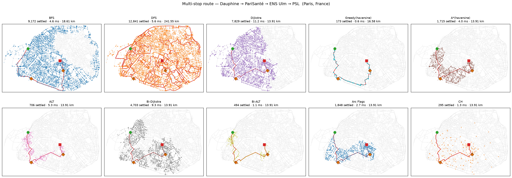
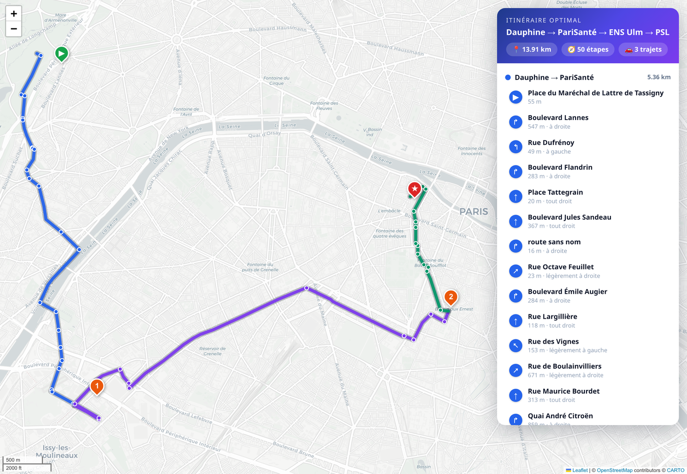
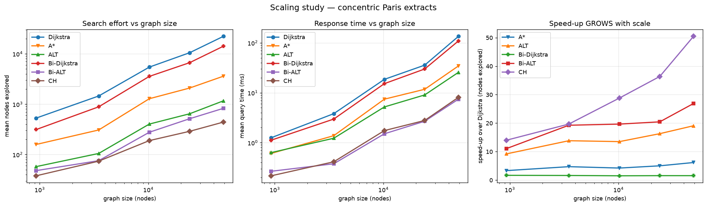

# Shortest Paths on Real Road Networks

This project computes shortest driving routes on a **real** OpenStreetMap road
network (the thing a GPS or Google Maps does) and studies *how the choice of
search algorithm and heuristic changes the amount of work done*. The difficulty
is **scale**: a city graph has thousands to hundreds of thousands of nodes, so
the naive "explore everything" approach is wasteful.

We implement, prove correct, and benchmark a family of algorithms ranging from
the classic fundamentals to modern, state-of-the-art speed-up techniques, all
returning the **same optimal route** but doing vastly different amounts of work.

The running example is a real multi-stop trip across Paris —
**Université Paris Dauphine-PSL → PariSanté Campus → ENS (Rue d'Ulm) → PSL
(Rue Mazarine)** — solved as a sequence of shortest-path legs.

<p align="center">
  
  <br><em>The explored region ("stain") per algorithm for the full journey.
  Dijkstra floods a disk; A* an ellipse; ALT/Bi-ALT a thin corridor along the
  route. 🟢 start · 🔶 intermediate stops · 🟥 end.</em>
</p>

<p align="center">
  
  <br><em>The same journey, animated: every algorithm explores at the same pace,
  so the frugal ones (ALT, Bi-ALT) visibly finish the whole trip while Dijkstra
  and Bi-Dijkstra are still flooding the city.</em>
</p>

---

## 1. What is implemented

Ten shortest-path algorithms, from the fundamentals to advanced techniques:

| Algorithm | Optimal? | Kind | Idea |
|---|:--:|:--:|---|
| **BFS** | ⚠️ hops only | fundamental | fewest-**edges** path; wrong in metres → motivates edge weights |
| **DFS** | ❌ | fundamental | returns *some* path, usually absurdly long |
| **Dijkstra** | ✅ | fundamental | baseline; expand the node with smallest travelled distance `g` |
| **Greedy Best-First** | ❌ | fundamental | expand the node with smallest heuristic `h` — fast but detours |
| **A\* (haversine)** | ✅ | fundamental | `f = g + h`, `h` = straight-line (crow-flies) distance |
| **ALT** | ✅ | fundamental | A\* with the **L**andmarks + **T**riangle-inequality heuristic |
| **Bidirectional Dijkstra** | ✅ | advanced | search from both ends, meet in the middle |
| **Bidirectional ALT** | ✅ | advanced | bidirectional A\* with ALT + average-potential reweighting |
| **Arc Flags** | ✅ | advanced | partition the map into regions; per-arc flags prune arcs that can't reach the target region |
| **Contraction Hierarchies** | ✅ | advanced | add *shortcuts*, queries only ever climb the node hierarchy — the modern standard |

Plus two **data-structure / heuristic optimisations**:

* a **bucket queue** (Dial's array of stacks) as an alternative to the binary
  heap for the open list — exact for Dijkstra when the bucket width ≤ the minimum
  edge weight;
* **active landmark selection** (`num_active`): only the few most useful
  landmarks are consulted per query, cutting the per-node cost when `k` is large.

Four **landmark-selection strategies** are compared: `random`, `planar`
(geometric extremes), `farthest` (greedy *k*-centre), and `avoid`
(Goldberg-Werneck adaptive selection).

Every optimal algorithm is checked, on every query, to return **exactly**
Dijkstra's path length (the harness aborts on any mismatch), so the comparison is
always between algorithms returning the same route.

---

## 2. Install

```bash
python3 -m venv .venv
source .venv/bin/activate
pip install -r requirements.txt
```

The first run downloads a map extract from OpenStreetMap via `osmnx` and caches
it under `data/` (a few seconds); later runs load instantly from the cache.

---

## 3. Run

```bash
# 1) The running example — a multi-stop journey through waypoints, IN ORDER
#    (like GPS "via" points). Each --stop is an exact address, geocoded via
#    OpenStreetMap; --label sets the pretty name shown in the figures.
#      --gif         also renders the animated exploration (results/exploration.gif)
#      --directions  prints the turn-by-turn route sheet (which streets to follow)
#      --map         saves a pretty interactive HTML map (results/itinerary_map.html)
python scripts/run_multi_stop.py \
    --stop "Place du Maréchal de Lattre de Tassigny, 75016 Paris, France" \
    --stop "10 Rue d'Oradour-sur-Glane, 75015 Paris, France" \
    --stop "45 Rue d'Ulm, 75005 Paris, France" \
    --stop "60 Rue Mazarine, 75006 Paris, France" \
    --label "Dauphine" --label "PariSanté" --label "ENS Ulm" --label "PSL" \
    --gif --directions --map

# 2) Full benchmark over many random queries (nodes explored + time + optimality)
python scripts/run_benchmark.py --place "Paris, France" --queries 200

# 3) Effect of landmark choice (strategy and number k)
python scripts/run_landmark_study.py --place "Paris, France" --queries 100

# 4) Scaling study — how the speed-ups GROW with graph size (the core thesis)
python scripts/run_scaling_study.py

# 5) Statistical analysis — effort distribution + stratification by trip distance
python scripts/run_query_distribution.py --place "Paris, France" --queries 300
```

Everything works on **any** place `osmnx` understands, e.g.
`--place "Boulogne-Billancourt, France"` or `--place "Cambridge, UK"`.

---

## 4. What each run produces

All artefacts are written to `results/`:

| Output | Produced by | What it is |
|---|---|---|
| `multi_stop_comparison.png` | `run_multi_stop.py` | explored region + route, one panel per algorithm |
| `exploration.gif` | `run_multi_stop.py --gif` | the same exploration, animated over time |
| `itinerary_map.html` | `run_multi_stop.py --map` | interactive Leaflet map of the route (open in a browser) |
| turn-by-turn sheet | `run_multi_stop.py --directions` | printed street-by-street directions |
| `benchmark_summary.png`, `benchmark.csv` | `run_benchmark.py` | nodes explored + time per algorithm |
| `landmark_study.png`, `landmarks_*.png` | `run_landmark_study.py` | effect of landmark count/strategy + placement maps |
| `scaling_study.png`, `scaling_study.csv` | `run_scaling_study.py` | speed-ups vs graph size |
| `query_distribution.png` | `run_query_distribution.py` | distribution of search effort |

The interactive map is the "GPS view" of the optimal route — coloured per leg,
with clickable turn markers and a route-sheet panel:

<p align="center"></p>

---

## 5. Headline results (Paris, 9,235 nodes, 200 random queries)

| algorithm | mean nodes explored | vs Dijkstra | mean time | optimal |
|---|--:|--:|--:|:--:|
| Dijkstra | 4,710 | 1.0× | 6.5 ms | ✅ |
| Greedy (haversine) | 95 | 49.6× | 0.3 ms | ❌ (+79% longer) |
| A\* (haversine) | 882 | 5.3× | 2.1 ms | ✅ |
| **ALT** | 286 | 16.5× | 1.9 ms | ✅ |
| Bi-Dijkstra | 2,900 | 1.6× | 5.5 ms | ✅ |
| Arc Flags | 652 | 7.2× | 0.98 ms | ✅ |
| **Bi-ALT** | 234 | 20.1× | **0.56 ms** | ✅ |
| **Contraction Hierarchies** | **175** | **26.9×** | 0.77 ms | ✅ |

Among the **optimal** algorithms, **Contraction Hierarchies** explores the
fewest nodes (26.9× fewer than Dijkstra) and **Bidirectional ALT** is the fastest
in wall-clock — all returning the exact same optimal route. Greedy is cheapest to
run but its paths are ~79 % longer (not optimal); BFS/DFS return valid paths that
are optimal in *hops* / arbitrary, not in metres.

**The gains grow with scale.** The whole point of these techniques is that they
pay off more as the graph grows. On concentric Paris extracts from ~900 to
~49,000 nodes, CH's speed-up over Dijkstra climbs from 14× to **50×**:

<p align="center"></p>

---

## 6. The report

A full write-up (problem modelling, the algorithm theory with proofs and the
directed triangle inequalities behind ALT, the experimental methodology, the
scaling study and the statistical analysis) is in **`latex/report.pdf`**.

---

## 7. Project layout

```
src/
  network.py          RoadNetwork: compact graph (CSR) from OSM + haversine + nearest node
  priority_queue.py   binary heap + Dial bucket queue (array of stacks)
  heuristics.py       haversine (crow-flies) admissible heuristic
  landmarks.py        landmark selection (random/planar/farthest/avoid) + ALT bound
  algorithms/         bfs_dfs, dijkstra, greedy, astar, alt, bidirectional,
                      arcflags (Arc Flags), contraction (Contraction Hierarchies)
  benchmark.py        fair comparison harness + optimality check
  itinerary.py        turn-by-turn route sheet (street names + turns) from a path
  interactive_map.py  interactive HTML map of the route (Leaflet/folium)
  visualize.py        explored-stain and landmark-placement plots
  animate.py          animated GIFs of the exploration growing over time
scripts/              run_multi_stop, run_benchmark, run_landmark_study,
                      run_scaling_study, run_query_distribution
latex/                LaTeX report (report.tex + chapters/) -> report.pdf
data/, results/       cached maps / generated figures (created on first run)
```
